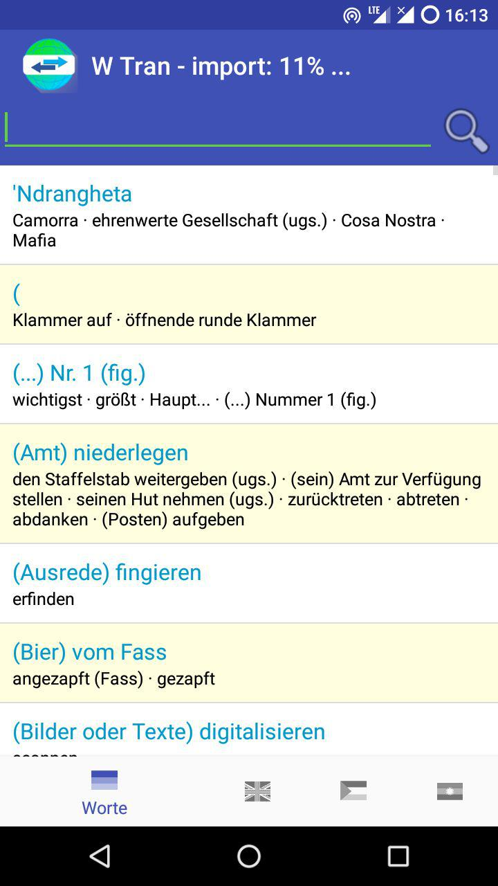
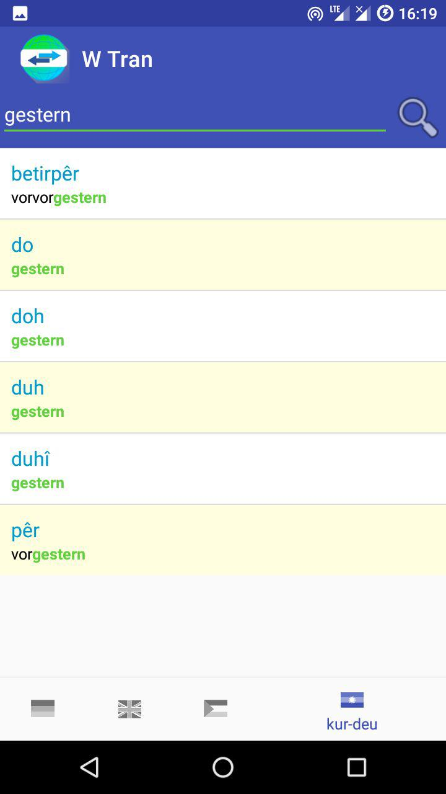
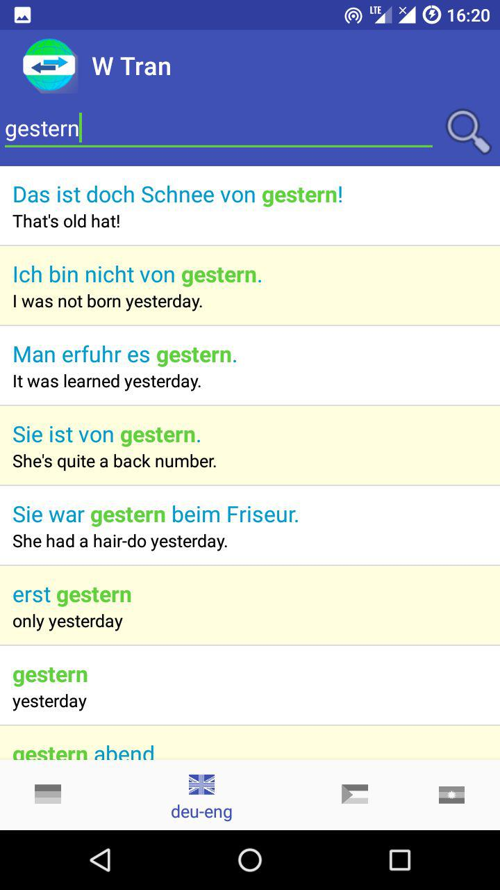
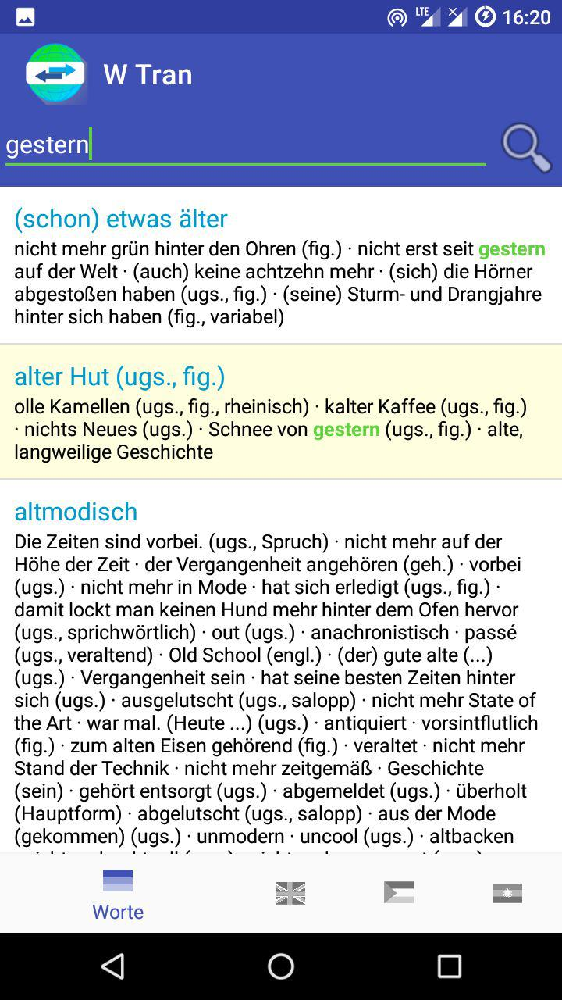
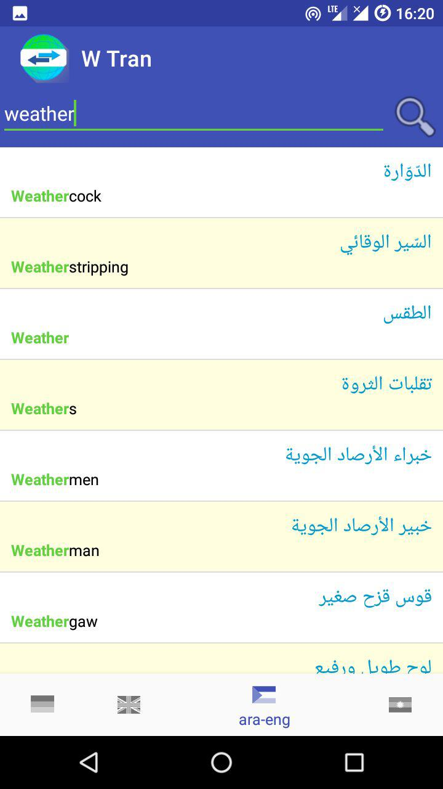
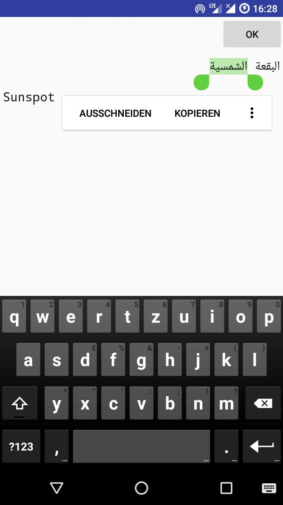

# W Tran

A database offline translator and german dictionary.

this is a very slow starting simple de-eng, eng-de offline translator using two big
tei xml-files from [freedict.org](https://github.com/freedict/fd-dictionaries).

**This App is in beta state!!!**

## Get the App

You can get a signed APK from here (Android 4.4+): [APK](https://raw.githubusercontent.com/no-go/offlineTranslator/master/offtrans/app/release/app-release.apk)

## Feature

- initial offline in app import to a fast database
- dictionary: german
- lexicon: german-english, arabic-english, kurdi-german
- copy/paste edit window (on tap)
- search (both sides)

## Is it ready?

no.

- It will be better to have a reimport button, if initial import crashs.
- It will be better to make the tei files downloadable or import file from your phone.
- many informations of the TEI files are not displayed

## I need kurdî -> türkçe !

Because freedict has this dictionary, it is easy to implement this! 
Take a look on this [commit](https://github.com/no-go/offlineTranslator/commit/84e5cfcc1d189bb4c6a826c5374a053b82771a92), how to easy add other translations.

## Screenshots

