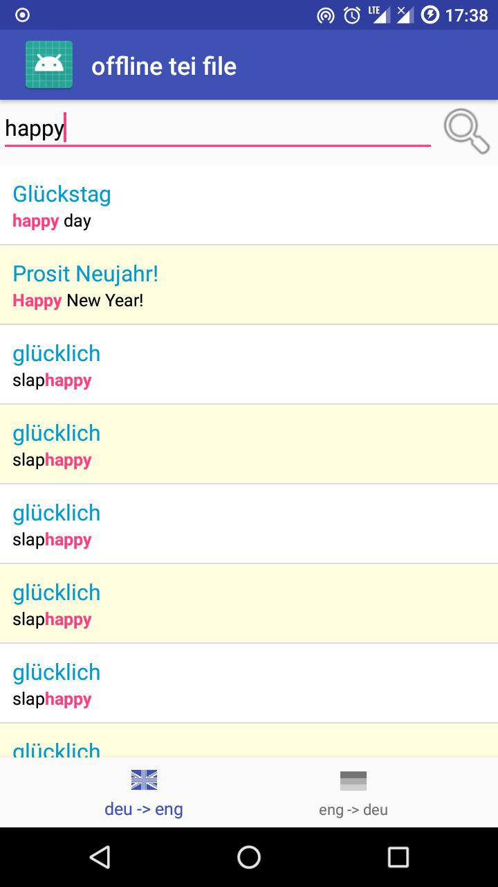

# offline Translator

this is a very slow starting simple de-eng, eng-de offline translator using two big
tei xml-files from [freedict.org](https://github.com/freedict/fd-dictionaries).

This App is for test use !!!

## Get the App

You can get a signed APK from here (Android 4.4+): [APK](https://raw.githubusercontent.com/no-go/offlineTranslator/master/offtrans/app/release/app-release.apk)

## Is it ready?

no.

- I will be better to import the stuff from the TEI files only once and add the data to a database on your phone.
- I will be better to make the tei files downloadable or import file from your phone.
- many informations of the TEI files are not displayed

## I need kurdî -> türkçe !

Because freedict has this dictionary, it is easy to implement this! *look at my last commit, how to easy add other translations*

## Screenshot

